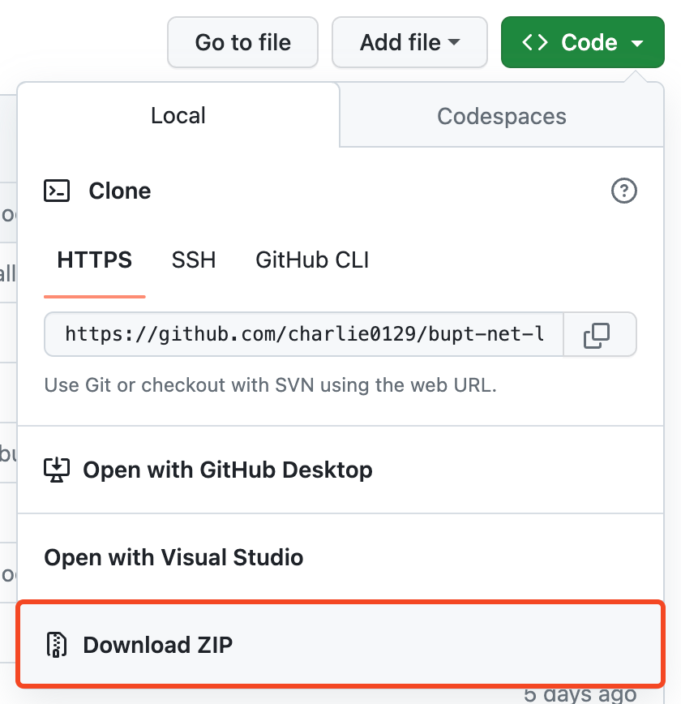
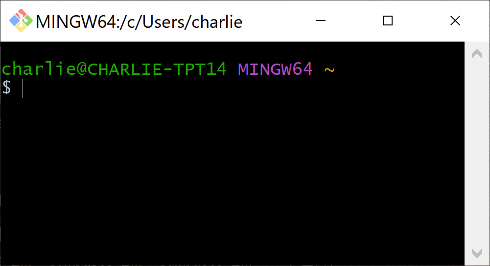
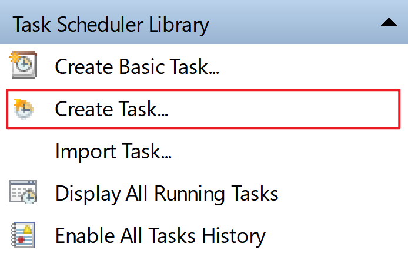
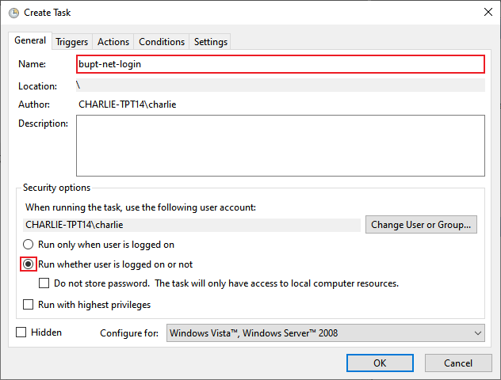
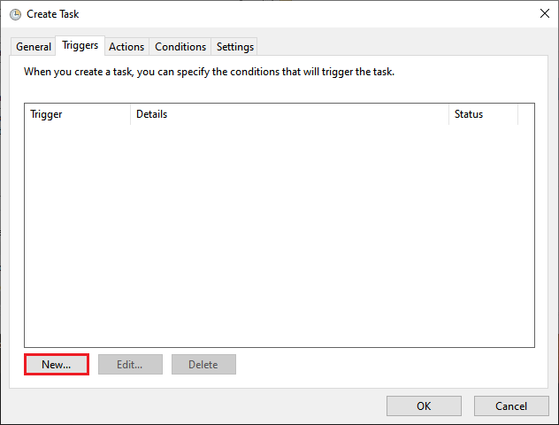
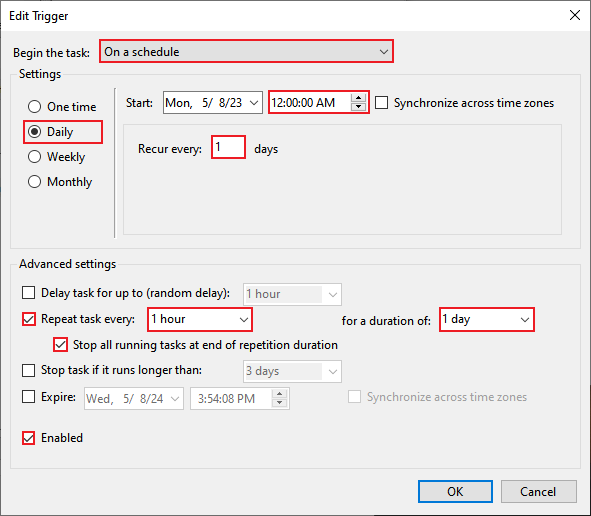
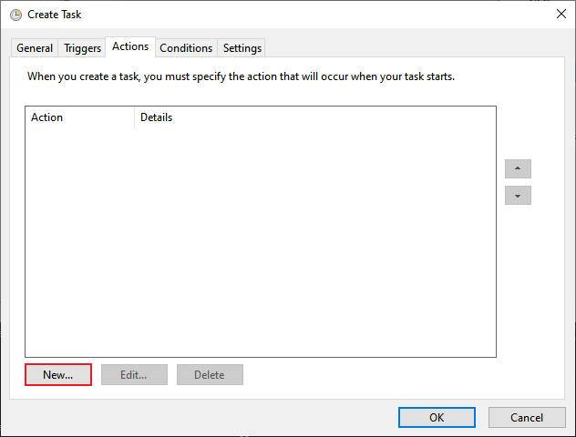
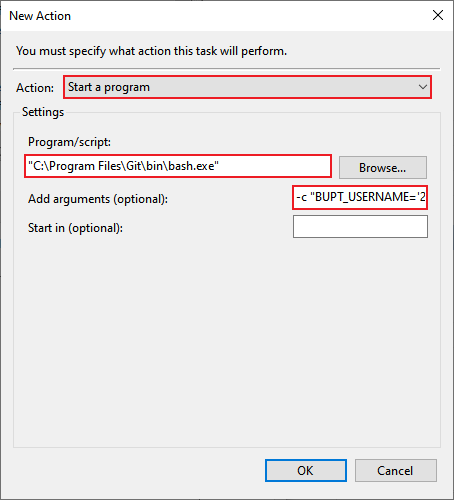
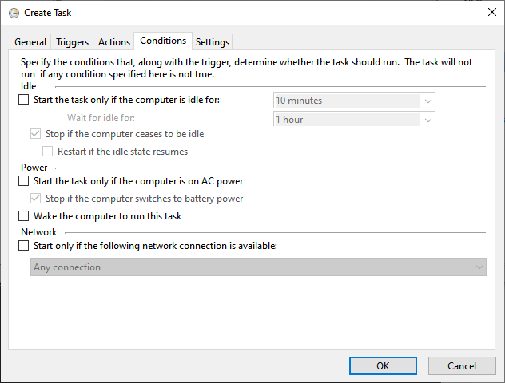

# bupt-net-login

这是一个用于认证北京邮电大学校园网网关的脚本（包括有线网和无线网 BUPT-portal ）。支持带参数 AC 重定向认证、掉线重连。支持所有能运行 bash 和 curl 的操作系统（包括 Linux, macOS, FreeBSD, Windows 等）。

还在因为服务器没有 GUI 难以登录校园网而烦恼吗？还在因为偶尔网络掉线而忧虑吗？快用 bupt-net-login 吧！

## 为什么选择这个脚本

众所周知，现在北邮无线网 (portal) 认证 `10.3.8.216` 需要带参数了（有线网 `10.3.8.211` 暂时还不需要）。传统一个 POST 直接硬怼 `10.3.8.216/login` 的方法不行了（目前绝大多数的脚本都是这么做的），所以跑不了了。即自行访问 Captive Portal 认证页，而非由 AC 重定向，将会缺少必要参数，当 ClearPass 缓存过期时，认证页将会提示用户"认证失败 0x01000003"。

这个脚本能同时处理 **有线网** 和 **无线网** 的带参数认证方式、遵循 AC 重定向，并掉线自动登录，确保长期在线。

如果后续北邮认证又做了什么更改，我又没更新，可以提 issue （x 。

## 快速开始

- 如果你用的是 Linux 且知道 Docker , 请查阅 [使用 Docker](#使用-docker) ，这是最简单的方法，一行命令即可完成。

- 如果你用的是 Windows ，请跳过其他部分，直接阅读 [Windows 用户单独说明](#windows-用户单独说明) 。当然你也能先看一下 [准备工作](#准备工作) 。

- 其他情况，请先阅读 [准备工作](#准备工作) 再查阅 [直接运行](#直接运行) 。

## 准备工作

首先，建议在类 Unix 系统下运行该脚本（例如 Linux, macOS, FreeBSD 之类），因为：

- 本脚本的全部依赖（例如 curl, bash）通常在这些操作系统下都是默认满足的，所以能直接跑；
- Linux, FreeBSD 之类操作系统一般不安装 GUI ，登录网关认证没那么简单，符合本脚本解决的问题；

> 那 Windows 用户怎么办？最简单的就是直接用浏览器登录得了，毕竟带 GUI 。
>
> 如果你说我就是想要在 Windows 下自动化登录怎么办呢？ 其实 Windows 也是可以跑这个脚本的，不过 Windows 默认不带 bash ，自带的 [假 curl](https://github.com/PowerShell/PowerShell/pull/1901) 也有点问题，所以需要一些额外的操作。请阅读 [Windows 用户单独说明](#windows-用户单独说明) ，这里会有操作说明。
>
> 注意：对于 Windows 用户来说，接下来 [自动登录](#自动登录) 的章节请直接跳过（因为不针对 Windows ），[Windows 用户单独说明](#windows-用户单独说明) 有 Windows 的做法。

然后您需要确保你的计算机上有 `bash` 和 `curl` 。一般来说这两个条件都已经满足。可以直接在命令行运行 `bash --version` 和 `curl --version` 来检查，如果没有，安装即可。

> Windows 用户记得在 Git Bash 里面跑（或者其他 bash 环境）。

## 手动登录

立即登录网关，只登录一次，一般用于测试。

首先下载该项目下的 `bupt-net-login` 文件并 `chmod +x bupt-net-login` 。

```bash
BUPT_USERNAME='你的学号' BUPT_PASSWORD='你的网关密码' ./bupt-net-login
```

> Windows 用户记得在 Git Bash 里面跑（或者其他 bash 环境）。

<details>
<summary>样例输出</summary>

如果你已经登录：
```console
2023-05-06 09:24:16 [INFO] 您已经登录, 无需进一步操作
```
如果你没有登录：
```console
2023-05-06 09:24:16 [INFO] 您未登录, 准备认证...
2023-05-06 09:24:16 [INFO] 准备使用账号 xxx 进行认证, 认证地址 xxx
2023-05-06 09:24:16 [INFO] 获取 cookie ...
2023-05-06 09:24:16 [INFO] 正在认证...
2023-05-06 09:24:17 [INFO] 账号 xxx 认证成功
```
</details>

## 自动登录

这是建议的用法，可以保证你的网关一直都是登录的。默认情况下会 _每小时_ 检查网关是否登录，如果没有将自动登录。

有两种运行方法: Docker 和 直接运行。

### 使用 Docker

如果你的系统是 Linux 并有 Docker ，那么这是建议的方法。如果你不知道什么是 Docker ，那么你可以使用下一种方法。

对于 `docker` ，你可以直接 `docker run` 或者使用 `docker compose`。

- 直接使用 `docker run` 只需一行命令即可：
    ```bash
    docker run \
        --detach \
        --name bupt-net-login \
        --restart unless-stopped \
        --network host \
        -e BUPT_USERNAME="你的学号" \
        -e BUPT_PASSWORD="你的网关密码" \
        charlie0129/bupt-net-login
    ```
    参数说明：`--detach` 表示在后台运行，如果你调试时需要在前台运行，将其替换成 `-it --rm`；`--restart unless-stopped` 指定了自动重启的策略，即在意外停止后自动重开（例如重启计算机后）；`--network host` 表示使用宿主机网络协议栈，以防走 NAT 可能会有的奇怪小问题。

    接下来它会在后台运行并自动检查登录态（重启后也能继续）。后续你可以使用 `docker logs bupt-net-login` 查看日志；`docker stop bupt-net-login` 来停止运行；`docker rm bupt-net-login` 来删除容器；

- 使用 `docker compose`：你可以查阅本项目下的 `docker-compose.yml` ，其中包含了足够的例子。然后使用 `docker compose up -d` 来启动。

> `charlie0129/bupt-net-login` Docker 镜像支持的平台包括 `linux/amd64` ( 64 位 x86 ), `linux/386` ( 32 位 x86 ), `linux/arm64` ( 64 位 arm ), `linux/arm/v7` `linux/arm/v6` ( 32 位 arm ), `linux/s390x` (IBM z Systems), `linux/ppc64le` (IBM POWER8) 。应该正常人能接触到的绝大多数设备都可以运行吧！如果你真的有一些莫名其妙的架构的处理器那欢迎提 issue 。

### 直接运行

如果你本机没有 Docker ，或者你觉得运行 Docker 对你来说太重或太困难（例如 macOS 和 FreeBSD ），或者你不知道什么是 Docker 。那么本机直接运行都是建议的方法，你可以选择 **在线安装** 或者 **离线安装** 。

注意： **在线安装** 需要你的网络能够访问 GitHub 。如果你不知道怎么做，那请使用 **离线安装** 的方法。

- **离线安装:**
    首先需要下载本项目下的 `bupt-net-login` 这个文件（无论通过哪种方式，例如 GitHub 网页下载、 git clone 等等，只要拿到这个文件就行。如果你在服务器上，那么想办法传上去就行，例如使用 scp ），并 `chmod +x bupt-net-login` 。然后运行：
    ```bash
    BUPT_USERNAME='你的学号' \
        BUPT_PASSWORD='你的网关密码' \
        sudo ./bupt-net-login install
    ```
    安装完就可以删除 `bupt-net-login` 这个文件了。安装脚本会做这几件事：
    - 安装 bupt-net-login 至 /usr/local/bin （这也是需要 sudo 的原因）。如果你不想用 sudo 或者想更改安装位置, 请设置 PREFIX 环境变量。例如安装至 `~/bin` 可以这么写：
        ```bash
        BUPT_USERNAME='你的学号' \
            BUPT_PASSWORD='你的网关密码' \
            PREFIX=$HOME/bin \
            ./bupt-net-login install
        ```
    - 移除之前的 bupt-net-login cron job （如果有的话）。
    - 安装 cron job （用于定时检查登录态）至当前用户（如果你用了 sudo 那就是 root ，如果没有那就是当前用户）。
- **在线安装:**
    ```bash
    # 如果你不能访问 GitHub , 建议跳过这部分。
    # 当然，你也可以通过改变下载地址, 设置 https_proxy 等方式解决网络问题。
    DOWNLOAD_URL="https://github.com/charlie0129/bupt-net-login/raw/master"
    # 临时下载脚本
    curl -fsSL ${DOWNLOAD_URL}/bupt-net-login > bupt-net-login
    # 安装脚本
    BUPT_USERNAME='你的学号' \
        BUPT_PASSWORD='你的网关密码' \
        PREFIX=$HOME/bin \
            bash ./bupt-net-login install
    # 删除临时脚本
    rm -f bupt-net-login
    ```

接下来它会在后台运行并自动检查登录态，后续你可以使用 `cat /tmp/bupt-net-login.log` 查看日志。

如果你需要卸载：使用 `crontab -e` 来删除带有 `bupt-net-login` 字样的行即可。（如果你安装时用了 sudo ，那现在也需要使用 `sudo crontab -e` ）

## 高级

### 自定义 cron

默认每小时检查一次登录态，你可以通过附加命令行参数来自定义它，参数为标准 cron 格式 `x x x x x` ，注意时区。

例如你想每分钟运行一次：
- 在 `docker run` 的时候附加参数：`docker run <省略> charlie0129/bupt-net-login "* * * * *"` 
- 本机运行 `./bupt-net-login install` 的时候附加参数：`<环境变量省略> ./bupt-net-login install "* * * * *"`。

### Windows 用户单独说明

众所周知， Windows 下面是没有 bash 的，自带的 curl 也是 [假 curl](https://github.com/PowerShell/PowerShell/pull/1901) ，根本没法用。所以如果想在 Windows 下跑这个脚本，那首先需要解决的是 bash 和 curl 的问题。

幸好， Git for Windows 已经为我们解决了这个问题（当本质上利用了它自带的 MinGW64 ）。作为北邮学子，相信你一定用过 Git 吧！（千万别说你不知道什么是 Git）既然你用过了，那就大概率已经安装了 Git for Windows 。

> 如果确实不知道并且没安装 Git for Windows ，那就现在装一下罢，使用搜索引擎搜索安装即可。

> Git for Windows 是最推荐最简单的方法，接下来的教程都基于它。如果你确实不想用 Git for Windows 自带的 MinGW64 ， **提示：** 你可以使用 MinGW, WSL **1** , Cygwin 等运行 bash 脚本。不过这样就需要靠你自行解决遇到的问题了罢。
>
> 注意： 不要使用 WSL **2** 运行这个脚本，根据我的经验因为 WSL2 的网络为 NAT 可能会存在问题。而且 WSL2 作为 VM ，在 idle 的时候会自动关机，不能保证长期在线。（当然我也没有细究，如果你成功了，欢迎提 issue ）

从 GitHub 下载代码：

</img>

然后你需要打开 Git Bash ，它长这样：

</img>

</img>

接下来你只需知道，README 里面读到的每一行命令都需要在 Git Bash 里面执行（别在 cmd 或者 PowerShell 里面跑，大概率跑不了）。不过你忘了也没事，会持续提醒你的（

你可以先尝试一下 [手动登录](#手动登录) 看看能不能跑。

如果可以跑，那就能继续配置自动登录了。（相当于 [自动登录](#自动登录) 章节的 Windows 做法）。在开始前确保你已经下载了本项目下的 bupt-net-login 文件，后面要用到（你可以把它放在一个容易找到的位置，例如 C 盘根目录）。

首先你需要打开 Task Scheduler （计划任务），你可以使用 win+S 搜索。

</img>

选择 Create Task

</img>

填写任务基本信息，接下来基本照着做就行，注意红框中的要点。

</img>

</img>

</img>

</img>

</img>

**注意：**

- 这里的 `Program/script` 为你的 Git for Windows 中 bash 的位置，一般情况下保持图中的值即可。如果你修改过安装目录则对应修改，图中 `"C:\Program Files\Git\bin\bash.exe"` 为默认位置。 
- `Add arguments` 中填入 `-c "BUPT_USERNAME='你的学号' BUPT_PASSWORD='你的网关密码' bash '你的bupt-net-login所在位置' >>/tmp/bupt-net-login.log 2>&1"` 。注意这里有三处你需要替换的地方： 1. 学号 2. 网关密码 3. bupt-net-login 所在位置。 **不要漏掉任何一个标点！**

例如：

- 你下载的 bupt-net-login 放在了 C 盘根目录 （ `C:\bupt-net-login` 对应到 bash 里面是 `/c/bupt-net-login` ） 
- 学号为 2019000000
- 密码为 00000000

那么你的 `Add arguments` 可以这么填写： `-c "BUPT_USERNAME='2019000000' BUPT_PASSWORD='00000000' bash '/c/bupt-net-login' >>/tmp/bupt-net-login.log 2>&1"`。 **不要漏掉任何一个标点！**

</img>

其他地方按需修改即可，然后点击 OK 创建任务。

你的 Windows 自动网关认证就配置完成了！他会在后台自动保持登录。

> 如果你需要查看登录日志，你可以查阅 `%TEMP%\bupt-net-login.log` （默认情况下是 `C:\Users\<username>\AppData\Local\bupt-net-login.log` ）
